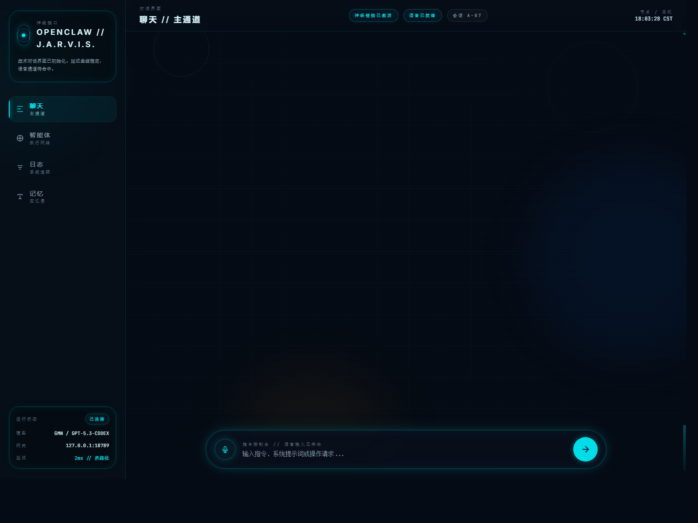
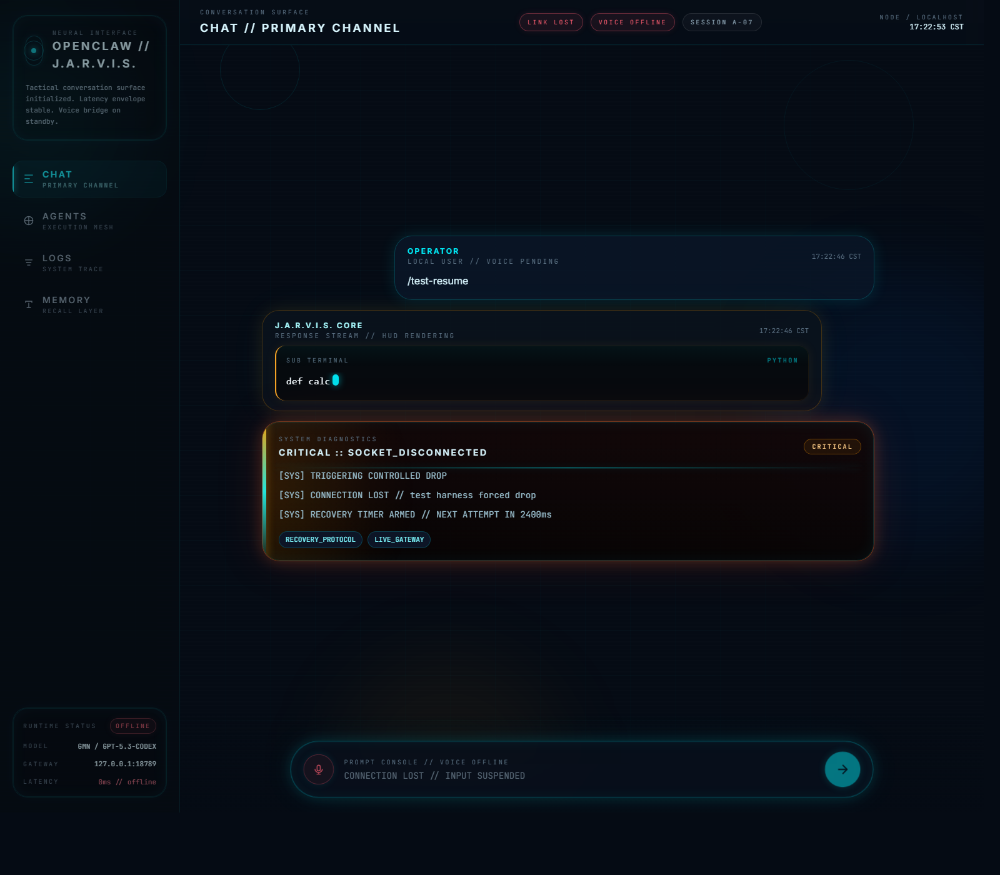

# OpenClaw Hub Runtime

**A reusable runtime for themeable real-time AI command interfaces on top of the real OpenClaw Gateway.**

> Not just another chat skin.  
> A runtime for battle-ready AI terminals.

OpenClaw Hub Runtime is a modular frontend runtime for AI command surfaces with **streaming UX**, **reconnect-aware diagnostics**, **resume/recovery foundations**, and **reusable shell bindings**.

## Why this repo is worth a star

- **Real backend, not a mock demo** — built around actual OpenClaw Gateway integration
- **Runtime, not a one-off shell** — one runtime already powers both a flagship Jarvis shell and a minimal shell
- **Resilience is part of the product** — reconnect, recovery, diagnostics, and resume flows are first-class
- **Designed to be reused** — shell identity and runtime behavior are intentionally separated

## What you can see in 30 seconds

### 1) Flagship Jarvis shell



### 2) Battle-damaged reconnect / poster mode



### 3) Minimal shell proving portability

See `examples/minimal-hub/README.md` and `examples/minimal-hub/index.html`.

---

## What this repository contains

- a flagship **J.A.R.V.I.S.-style shell**
- a reusable **runtime core**
- a real **OpenClaw Gateway adapter**
- a **reconnect and recovery layer**
- a deterministic **test harness**
- a **minimal shell example** proving portability

**Build one runtime once, then launch multiple AI shells on top of it.**

---

## Quick start

### Prerequisites

- OpenClaw Gateway running locally on `127.0.0.1:18789`
- a valid local gateway token stored outside published history
- a local static file server

### Start a local server

```powershell
cd d:\openclaw
python -m http.server 8787
```

### Open the shells

**Jarvis shell**

```text
http://127.0.0.1:8787/apps/jarvis-hub/index.html
```

**Minimal shell**

```text
http://127.0.0.1:8787/examples/minimal-hub/index.html
```

**Resume showcase**

```text
http://127.0.0.1:8787/apps/jarvis-hub/index.html?testResume=1
```

**Poster showcase**

```text
http://127.0.0.1:8787/apps/jarvis-hub/index.html?testResume=1&poster=1
```

For a fuller setup guide, see `docs/getting-started.md`.

---

## Core features

- real OpenClaw Gateway WebSocket connection
- `connect`, `health`, `chat.history`, `chat.send`, `agents.list`
- soft-throttled streaming assistant output
- fenced code block rendering as sub-terminals
- sidebar agent list
- diagnostics-first reconnect UX
- resume / reconcile / replay foundations
- built-in `/diagnose` and `/test-resume` showcase commands
- shared Chinese copy support
- reusable shell binding through `HUB_CONFIG`

---

## Why follow this project

Star this if you care about any of these directions:

- reusable AI command interface runtimes
- real-time streaming UI on top of actual agent backends
- reconnect / recovery UX as a product feature
- shell portability instead of single-demo UI work
- OpenClaw-native frontend experiments with real integration

If you only want a pretty screenshot, this repo may be overbuilt.
If you want a strong reference point for **runtime + shell + resilience**, that is exactly what this project is trying to become.

---

## Architecture

OpenClaw Hub Runtime is organized as layered modules:

- **Hub Shell** — layout, shell DOM, copy loading, theme styling
- **Runtime** — shell binding, store, renderer, commands, bootstrap
- **Adapter** — OpenClaw transport and protocol handling
- **Reconnect Manager** — resilience, replay, recovery
- **Test Harness** — deterministic showcase and resume scenarios

Read the full system breakdown in `docs/architecture.md`.

---

## Documentation

- **Getting Started:** `docs/getting-started.md`
- **Architecture:** `docs/architecture.md`
- **Theming:** `docs/theming.md`
- **Adapter API:** `docs/adapter-api.md`
- **Launch Guide:** `docs/github-launch.md`
- **Launch Content Pack:** `docs/launch-content-pack.md`
- **Launch Kit:** `docs/launch-kit.md`
- **GitHub Publish Pack:** `docs/github-publish-pack.md`
- **Final Publish Preset:** `docs/final-publish-preset.md`
- **Star Pack:** `docs/star-pack.md`
- **Changelog:** `CHANGELOG.md`

---

## Shells

### Flagship shell
- `apps/jarvis-hub/index.html`

This is the cinematic HUD reference implementation.

### Minimal example shell
- `examples/minimal-hub/index.html`

This proves the runtime can boot a second shell with a simpler surface and different product feel.

---

## Repository layout

```text
apps/
  jarvis-hub/

examples/
  minimal-hub/

packages/
  adapters/openclaw/
  runtime/
  shared/
  test-harness/
  themes/

docs/
scripts/
```

---

## Release status

This repository is currently best understood as:

> the first public reference runtime for building OpenClaw-native AI command interfaces.

It is already a strong working implementation, but it is also the beginning of a broader reusable runtime direction.

---

## Contributing

Contributions are welcome. Start with:

- `CONTRIBUTING.md`
- `docs/architecture.md`
- `docs/theming.md`
- `docs/adapter-api.md`

Please run the PowerShell verification scripts before proposing changes.

---

## Security

If you discover a sensitive issue, see `SECURITY.md`.

---

## License

This repository is licensed under the MIT License. See `LICENSE`.
